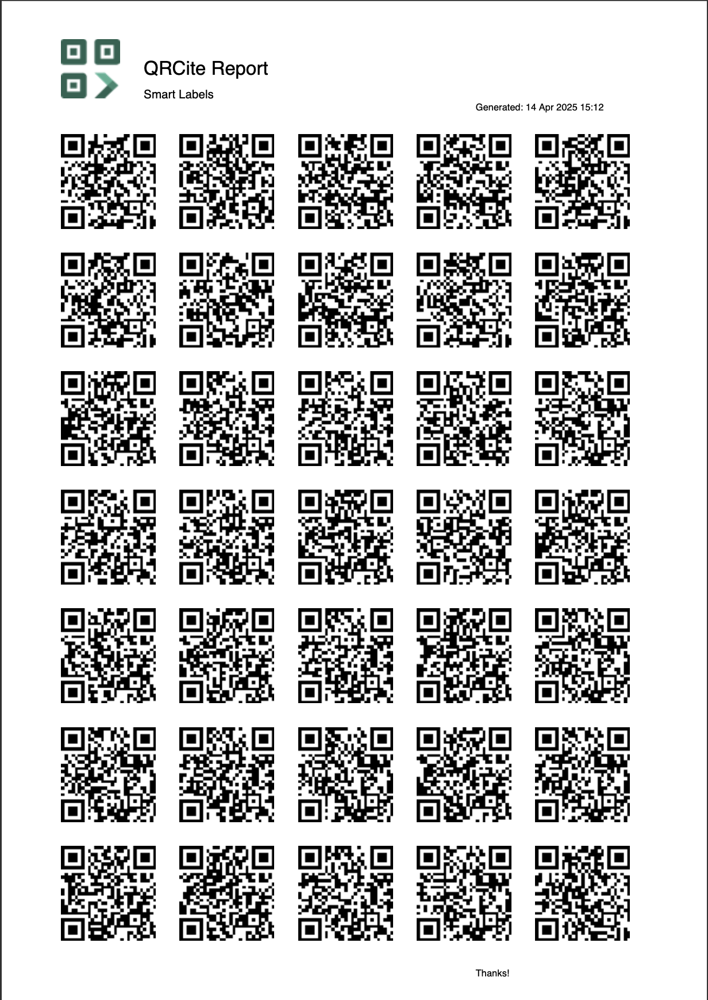

# qrpdfstream

A high-performance streaming PDF generator for embedding large sets of QR codes. Memory-efficient, customizable layout, and fully compatible with PDF viewers.

## Features

- ✅ Dynamic QR code layout based on target paper size
- ✅ Memory-efficient streaming writes (avoids buffering full PDF in memory)
- ✅ Custom headers, footers, and branding (e.g. logos)
- ✅ Parallel QR code generation
- ✅ Compatibility with macOS Preview, Adobe Acrobat, and modern PDF readers

## Why This Library Exists

While there are many PDF generation libraries available, most are not optimized for **streaming large numbers of QR codes** efficiently. Existing libraries often:

- **Load all content into memory**, which becomes inefficient or even unworkable for generating thousands of QR codes.
- Lack **fine-grained control over layout**, especially for grid-based QR arrangements.
- Do not support **progressive streaming to an `io.Writer`**, making them unsuitable for real-time or large-scale use cases.
- Have compatibility or rendering issues in viewers like **macOS Preview** or **Adobe Acrobat** when embedding raw image data.

We created `qrpdfstream` to address these gaps with a focus on:

- **Memory efficiency**, using a streaming architecture.
- **High performance**, with parallel QR code generation.
- **Customization**, allowing logos, headers, footers, and precise grid control.
- **Standards compliance**, ensuring the output is portable and viewer-safe.

This library is purpose-built for **industrial-scale QR code PDF generation**, such as manufacturing, asset tagging, smart labels, and certification systems.

## Performance

**Test Setup**:

- QR codes (80x80 grid)
- Machine: MacBook Pro M1, 16GB RAM

```bash
Qrcodes         Execution Time          File Size
100             34.9255ms               72KB
1000            220.442834ms            702KB
10000           1.566405916s            7MB
100000          13.861290208s           70.3MB
```

**Results**:

- ⏱️ PDF generation time: ~1.5 seconds/10k qrcodes
- 💾 Peak memory usage: ~45 MB  
- 🧠 Memory reused via QR code buffer pools and streaming logic  
- 🖨️ Streaming write every 5 MB (progressive output)

> Unlike traditional libraries that load the full document into memory, `qrpdfstream` writes the PDF progressively, reducing GC pressure and improving responsiveness in large-scale operations.

## Project Structure

```bash

qrpdfstream/
├── go.mod
├── LICENSE
├── README.md
├── cmd/
│   └── generate/              # CLI or example app
│       └── main.go
├── internal/
│   └── utils.go               # helper functions (e.g. escape string, image utils)
├── pdf/
│   └── writer.go              # PDF struct and streaming logic
├── qrcode/
│   └── generator.go           # QR code generation logic
├── layout/
│   └── layout.go              # Layout calculator
└── assets/
    └── qrcite.png            # Sample logo (for example/demo)
```

## Install

```bash
go get github.com/Raj63/qrpdfstream
```

## Usage

You can use `qrpdfstream` as a Go library.

### Example

[Example go code](cmd/generate/main.go)

### Output

[View output pdf file](cmd/generate/qrstreamed_1k.pdf)

### Screenshot

Here’s a preview of the QR code streaming output:

